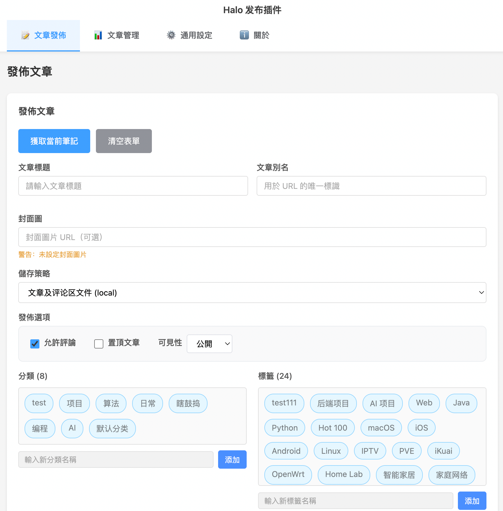

# 思源筆記 Halo 發佈插件

[简体中文](README.md) | [English](README_en_US.md)

<div align="center">
  
  <h3>連接思源筆記與 Halo 部落格的橋樑，為您提供無縫的寫作發佈體驗</h3>
</div>

## ⚠️ 重要用前須知

**本插件由 AI 輔助開發，開源免費，但不對功能可用性做出任何保證，使用前及使用中請自行備份數據、自行承擔風險，作者對本插件造成的任何後果不負任何責任！**

如有任何使用中遇到的問題，歡迎反饋，但是不保證修復時效（聽說打賞和去 GitHub 點 Star 能加快修 Bug 哦😘）。

本插件不出意外的話在未來不會支持除 Halo 外的任何其他部落格平台，有相關需求者請選用其他插件。

---

## 📖 簡介

**Halo Publisher** 是一款專為思源筆記打造的發佈插件，深度適配 Halo 2.0+ 部落格平台。它不僅是一個簡單的發佈工具，更是一個完整的文章管理解決方案。通過本插件，您可以直接在思源筆記中完成文章的撰寫、發佈、更新以及分類管理，無需在兩個平台間反復切換，讓創作回歸純粹。

### 核心亮點

- **簡約介面**：採用清晰明快的介面設計，操作流暢自然。
- **豐富參數**：支持文章內容、標題、元數據（Slug、摘要）等的設置。
- **圖片處理**：
  - **自動圖床**：自動解析並上傳筆記內的本地圖片到 Halo 附件庫。
  - **雲端兼容**：支持 Halo 的 GitHub OSS 等第三方存儲插件**（部分 Halo 插件會導致無法上傳圖片到 Halo 本地存儲庫，這不是本插件的 bug ，請去對應的 Halo 插件處反饋）**。
  - **智能去重**：圖片去重機制，避免重複上傳。
- **隱私安全**：所有請求直接通過思源內核代理，**零第三方中轉**，Token 與配置僅存儲於本地。
- **數據自由**：提供完整的配置與數據導入/導出功能，方便跨設備遷移或備份。
- **多語言支持**：支持簡體中文、繁體中文、英文。

---

## 用戶指南

### 1. 安裝與配置

#### 1.1 安裝插件

在思源筆記的集市中直接搜索安裝，或：

1. 下載最新的發佈包 `package.zip`。
2. 打開思源筆記，進入 **設置** -> **關於**，查看 **工作空間路徑**。
3. 進入工作空間目錄下的 `data/plugins/`，新建文件夾 `siyuan-plugin-halo-publisher`。
4. 將解壓後的所有文件放入該文件夾。
5. 重啟思源筆記，在頂欄啟用插件。

#### 1.2 建立連接


初次使用需配置 Halo 站點信息：
1. 點擊頂欄 Halo 圖標，進入 **通用設置** 標籤頁。
2. **站點地址**：輸入您的 Halo 2.x 部落格地址（例如 `https://blog.example.com`）。
3. **授權認證**：
   - **自動模式（推薦）**：點擊「🔐 自動登錄獲取 Cookie」，在彈出的內嵌窗口中登錄 Halo 後台。插件會自動捕獲認證信息。
   - **手動模式**：
     1. 在瀏覽器登錄 Halo 後台。
     2. 按 `F12` 打開開發者工具 -> 網絡(Network)。
     3. 刷新頁面，找到任意 API 請求，複製請求頭中的 `Cookie` 字段。
     4. 將其粘貼到插件的「Cookie」輸入框中。
4. 點擊 **保存並驗證**，若顯示「✅ 授權有效」，即表示連接成功。

### 2. 文章發佈流程



#### 2.1 準備文章
在思源筆記中完成文章撰寫。

#### 2.2 發佈設置
點擊插件圖標切換至 **文章發佈** 標籤頁，點擊獲取當前筆記：
- **文章標題**：自動讀取筆記標題，支持手動修改。
- **別名 (Slug)**：文章的 URL 標識。支持自動生成。
- **分類與標籤**：
  - 下拉選擇 Halo 中已有的分類/標籤。
  - 或輸入並創建新名稱。
- **發佈設置**：可設置是否允許評論、可見性等。

#### 2.3 執行發佈
點擊 **發佈到 Halo** 按鈕。
- **圖片處理**：插件會自動掃描文內圖片 -> 上傳至 Halo -> 獲取 URL -> 替換文內鏈接。
- **封面同步**：如果您在思源筆記中設置了封面，它將被自動設置為 Halo 文章封面。

### 3. 文章管理

在 **文章管理** 標籤頁，您可以查看所有已建立關聯的文章：
- **♻️ 更新**：本地修改筆記後，點擊更新可將變動同步至 Halo。
- **🔗 查看**：直接打開瀏覽器訪問部落格文章。
- **🗑️ 刪除**

### 4. 數據備份與遷移

為防止數據丟失或方便多設備使用，插件提供了完善的數據管理功能（位於 **通用設置** 底部）：

- **導出數據**：生成包含所有配置、發佈記錄（Siyuan ID ↔ Halo ID 映射）和圖片緩存的 JSON 備份文件。
- **導入數據**：恢復之前的備份（注意：導入操作會覆蓋當前的配置，且網站 URL 和 Cookie 不會被導入，需要重新登錄）。
- **清除數據**：徹底重置插件，清除所有本地存儲的配置和緩存。

---

## 🛠️ 開發者指南

本指南面向希望對插件進行二次開發或定制的高級用戶。

### 技術架構

項目基於 **Vue 3 + TypeScript + Vite** 構建，採用分層架構設計，確保了代碼的可維護性與擴展性。

| 模塊 | 路徑 | 職責說明 |
|------|------|----------|
| **UI Presentation** | `src/App.vue` | 基於 Composition API 的響應式介面，負責用戶交互與狀態展示。 |
| **Adaptor Layer** | `src/adaptors/` | 核心適配層。`HalowebWebAdaptor` 封裝了 Halo 2.0 Open API 的所有調用細節，實現了業務邏輯與底層 API 的解耦。 |
| **Core API** | `src/api/` | 基礎能力層。`BaseExtendApi` 處理底層 HTTP 請求代理、圖片隊列上傳及錯誤重試機制。 |
| **State Management** | `src/utils/*Store.ts` | 本地持久化存儲。包含發佈記錄 (`PublishStore`) 和圖片緩存 (`ImageCacheStore`) 的管理，實現了數據在思源端的落地。 |

### 開發環境搭建

**前置要求**：
- Node.js 16+
- pnpm

**步驟**：
1. 克隆倉庫：
   ```bash
   git clone https://github.com/YourRepo/siyuan-plugin-halo-publisher.git
   ```
2. 安裝依賴：
   ```bash
   pnpm install
   ```
3. 啟動開發服務器：
   ```bash
   pnpm run dev
   ```
   *注：開發模式下需手動將 `dist` 目錄鏈接到思源插件目錄。*

4. 生產構建：
   ```bash
   pnpm run build
   ```

### 調試建議
- **UI 調試**：插件 UI 本質是 WebView，可在思源筆記中通過右鍵 -> "Inspect" 打開開發者工具調試 Vue 組件。
- **API 調試**：查看 Console 面板的 `[HaloPublisher]` 前綴日誌，可追蹤詳細的請求參數與響應。

---

## 📄 許可證

本項目採用 [MIT 許可證](./LICENSE) 開源。歡迎提交 Pull Request 或 Issue 參與貢獻。
